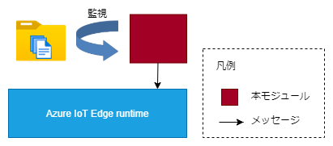
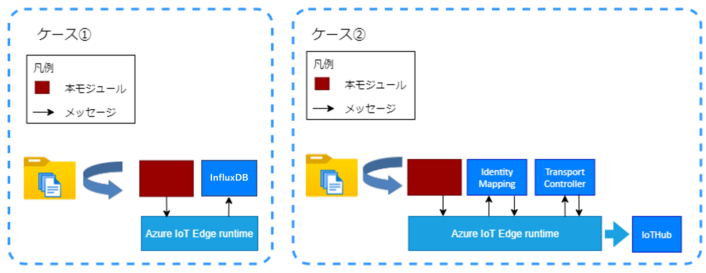

# CSVFileReceiver

## 目次
* [概要](#概要)
* [機能](#機能)
* [Quick Start](#quick-start)
* [イメージのURL](#イメージのurl)
* [動作保証環境](#動作保証環境)
* [Deployment 設定値](#deployment-設定値)
  * [環境変数](#環境変数)
  * [Desired Properties](#desired-properties)
  * [Create Option](#create-option)
* [受信メッセージ](#受信メッセージ)
* [送信メッセージ](#送信メッセージ)
  * [Message Body](#message-body)
  * [Message Properties](#message-properties)
* [Direct Method](#direct-method)
* [ログ出力内容](#ログ出力内容)
* [ユースケース](#ユースケース)
  * [ケース ①](#Usecase1)
  * [ケース ②](#Usecase2)
* [補足資料](#補足資料)
  * [AAA](#aaa)
* [Feedback](#feedback)
* [LICENSE](#license)

## 概要
CSVFileReceiverは、CSVファイルを監視し、検知したCSVファイルのレコードを送信するAzure IoT edgeモジュールです。

## 機能
フォルダ監視を行い、監視対象のCSVファイルの作成を検知して、ファイル内の行データをメッセージとして送信する。
メッセージ送信後、作成されたCSVファイルを削除・移動する。
※ 対応改行コードは、CRLF/LF。



## Quick Start
1. Personal Accese tokenを作成
（参考: [個人用アクセス トークンを管理する](https://docs.github.com/ja/authentication/keeping-your-account-and-data-secure/managing-your-personal-access-tokens)）

2. リポジトリをクローン
```
git clone https://github.com/Project-GAUDI/CSVFileReceiver.git
```

3. ./src/nuget_template.configの<GITHUB_USERNAME>と<PERSONAL_ACCESS_TOKEN>を自身のユーザー名とPersonal Accese tokenに書き換えて、ファイル名をnuget.configに変更してください

4. Dockerイメージをビルド
```
docker image build -t <IMAGE_NAME> ./CSVFileReceiver/src/
```
例）
```
docker image build -t ghcr.io/<YOUR_GITHUB_USERNAME>/csvfilereceiver:<VERSION> ./CSVFileReceiver/src/
```

5. Dockerイメージをコンテナレジストリにプッシュ
```
docker push <IMAGE_NAME>
```
例）
```
docker push ghcr.io/<YOUR_GITHUB_USERNAME>/csvfilereceiver:<VERSION>
```

6. Azure IoT edgeで利用

## イメージのURL
準備中
| URL                                                             | Description         |
| --------------------------------------------------------------- | ------------------- |

## 動作保証環境

| Module Version | IoTEdge | edgeAgent | edgeHub  | amd64 verified on | arm64v8 verified on | arm32v7 verified on |
| -------------- | ------- | --------- | -------- | ----------------- | ------------------- | ------------------- |
| 4.1.1          | 1.4.27  | 1.4.27    | 1.4.27   | ubuntu20.04       | －                  | －                  |


## Deployment 設定値

### 環境変数

#### 環境変数の値

| Key               | Required | Default       | Description                                                                                                                                                                                                           |
| ----------------- | -------- | ------------- | --------------------------------------------------------------------------------------------------------------------------------------------------------------------------------------------------------------------- |
| TransportProtocol |          | Amqp          | ModuleClientの接続プロトコル。<br>["Amqp", "Mqtt"]                                                                                                                                                    |
| LogLevel          |          | info          | 出力ログレベル。<br>各ログレベルでの出力内容については[ログ出力内容](#ログ出力内容)を参照<br>["trace", "debug", "info", "warn", "error"]                                                                                                                                   |
| InputPath         | 〇       |               | 監視するフォルダパス。                                                                                                                                                                                                  |
| BackupPath        | 〇       |               | 読み込みに成功したファイルの移動先ファイルパス。<br>info[x].after_processがMoveのインプットのみ有効<br>info[x].after_processにMoveが指定されているものが1つでもあり、この変数が指定されていない場合は監視が開始されない |
| ErrorPath         | 〇       |               | 読み込みに失敗したファイルの移動先ファイルパス。                                                                                                                                                                        |
| MaximumRetryCount |          | 5             | 作成されたファイルへの最大アクセスリトライ回数。<br>1以上の値を設定。                                                                                                                                               |
| RetryInterval     |          | 5000          | ファイルアクセス失敗時のアクセスインターバル(ミリ秒)。                                                                                                                                          |
| SortKey           |          | Name          | ファイルの読込順序キー。<br>["Name"（ファイル名）, "Date"（更新日時）]                                                                                                                            |
| SortOrder         |          | Asc           | ファイルの読込順序。<br>["Asc"（昇順）, "Desc"（降順）]                                                                                                                                            |
| WaitTime          |          | 0             | メッセージ送信後待機時間(ミリ秒)。                                                                                                                                            |
| DefaultSendTopic  |          | IoTHub        | 送信時のトピック形式。<br>["IoTHub", "Mqtt"]                                                                                                                                                        |
| M2MqttFlag        |          | false         | 通信に利用するAPIの切り替えフラグ。<br>false ： IoTHubトピックのみ利用可能。<br>true ： IoTHubトピックとMqttトピックが利用可能。ただし、SasTokenの発行と設定が必要。 |
| SasToken          | △       |               | M2MqttFlag=true時必須。edgeHubと接続する際に必要なモジュール毎の署名。 |

### Desired Properties

#### Desired Properties の値

| JSON Key                      | File Type                   | Required | Default | Description                                                                                                                                                                                                                                                                       |
| ----------------------------- | --------------------------- | -------- | ------- | --------------------------------------------------------------------------------------------------------------------------------------------------------------------------------------------------------------------------------------------------------------------------------- |
| info[x]                       | 共通                        | 〇       |         | 監視するファイル情報 （[x]は連番の数字）。                                                                                                                                                                                                                                        |
| &nbsp; file_type              | 共通                        | 〇       |         | 監視するファイルの種別。<br>（Standard ： "standard", AAA ： "aaa"のいずれかで指定）                                                                                                                                                                                 |
| &nbsp; output_name            | 共通                        | 〇       |         | 送信するメッセージのアウトプット名。                                                                                                                                                                                                                                                |
| &nbsp; error_output_name      | 共通                        |          | null    | エラー時に送信するメッセージのアウトプット名。                                                                                                                                                                                                                                      |
| &nbsp; filter                 | 共通                        | 〇       |         | 監視ファイルのファイル名パターン （正規表現で指定）。                                                                                                                                                                                                                               |
| &nbsp; encode                 | 共通                        | 〇       |         | 監視ファイルのエンコードタイプ。<br>（utf-8 , shift-jis）                                                                                                                                                                                                                             |
| &nbsp; delimiter              | 共通                        | 〇       |         | ファイルの区切り文字。                                                                                                                                                                                                                                                              |
| &nbsp; data_start_line        | 共通                        | 〇       |         | データ部の先頭行番号。                                                                                                                                                                                                                                                              |
| &nbsp; eof_enabled            | 共通                        | 〇       |         | ファイルの終了を意図するメッセージの送信可否。                                                                                                                                                                                                                                      |
| &nbsp; after_process          | 共通                        | 〇       |         | ファイル読取後のファイル処理情報。<br>（移動 ： "move", 削除 ： "delete"のいずれかで指定）                                                                                                                                                                                             |
| &nbsp; send_header_enabled    | Standard                    | 〇       |         | ヘッダ行をメッセージ送信するか。                                                                                                                                                                                                                                                    |
| &nbsp; header_start_line      | AAA, <br>Standard ※ | 〇       |         | ヘッダ行の開始行番号。<br>※ ファイルタイプがStandardの場合は、「send_header_enabled」がtrueの場合のみ有効                                                                                                                                                                           |
| &nbsp; header_end_line        | AAA, <br>Standard ※ | 〇       |         | ヘッダ行の終了行番号。<br>※ ファイルタイプがStandardの場合は、「send_header_enabled」がtrueの場合のみ有効                                                                                                                                                                           |
| &nbsp; header_filter          | AAA                         |          |         | 指定した場合、ヘッダの値を置き換える。<br> ("{置換前の値}": "{置換後の値}")                                                                                                                                                                                                                           |
| &nbsp; ignore_first_row       | AAA                         |          | false   | レコード1列目を除去する。                                                                                                                                                                                                                                                           |
| &nbsp; data_interval          | AAA                         |          | 1       | データ部の送信行間隔。                                                                                                                                                                                                                                                              |
| &nbsp; data_conbine           | AAA                         |          | false   | 全データレコードを1レコードに結合する。                                                                                                                                                                                                                                             |
| &nbsp; data_property[y]       | Standard                    |          | null    | データ部の送信メッセージに含むプロパティ情報 （[y]は1から始まる連番）。                                                                                                                                                                                                             |
| &nbsp; &nbsp; name            |                             |          | null    | プロパティ名。                                                                                                                                                                                                                                                                      |
| &nbsp; &nbsp; column          |                             |          | null    | プロパティとしてセットするデータの列番。                                                                                                                                                                                                                                            |
| &nbsp; &nbsp; get_from        |                             |          | message | プロパティとしてセットするデータの取得元。<br>["message", "file"]<br>"message"を指定した場合、 出力メッセージ毎の先頭レコードから取得する。<br>"file"を指定した場合、入力ファイルの先頭レコードから取得する。                                                                                                                                                                                                                                                                     |
| &nbsp; culture                | 共通                        |          | ja-JP   | ユーザーカルチャー。                                                                                                                                                                                                                                                              |
| &nbsp; send_max_records       | 共通                        |          | 0       | 1回のメッセージ送信で送信する最大行数。<br>※1以上の数値： ファイル内で指定行数毎、または最終行に到達した時点で送信する<br> 0以下の数値： ファイルの最終行に到達した時点で送信する                                                                                                   |
| &nbsp; record_data_num        | 共通                        |          | 0       | 1レコード内の送信する最大列数を指定する。<br>※1以上の数値： 指定列までのデータを送信する<br>0以下の数値： すべての列を送信する                                                                                                    |
| &nbsp; filename_properties_enabled | 共通                        |          | false       | GAUDI標準のCSVファイル命名規約に従いMessageのUserPropertiesを付与する。<ul><li>CSVファイル命名規約 ※()は桁数<br> {送信先No.(3)}\_{フォーマットNo.(3)}\_{データ取得場所(15)}\_{可変データ(N)}.csv</li><li>データ取得場所の詳細</li><ul><li>国(2)</li><li>会社(2)</li><li>工場・棟(3)</li><li>データ種別(3)</li><li>フリーエリア(5)</li></ul></ul>                                                                                  |
| &nbsp; data_edit_option[y]    | 共通                        |          | null    | データの特殊変換指定 （[y]は1から始まる連番）。                                                                                                                                                                                                                                     |
| &nbsp; &nbsp; column          | 共通                        | 〇       |         | 特殊変換するカラム番号。                                                                                                                                                                                                                                                            |
| &nbsp; &nbsp; mode            | 共通                        | 〇      |         | 処理方法。<br>round…四捨五入<br>floor…切り捨て(マイナスは切り下げ)<br>truncate…切り捨て(マイナスは切り捨て)<br>ceiling…切り上げ<br>substring…文字列の一部を数値に変換                                                                                                               |
| &nbsp; &nbsp; digits          | 共通                        | △       |         | mode=round/floor/truncate/ceiling時必須。<br>小数桁数指定。                                                                                                                                                                                                                                                                      |
| &nbsp; &nbsp; output_format   | 共通                        | △       |         | mode=round/floor/truncate/ceiling時必須。<br>書式指定子。                                                                                                                                                                                                                                                                        |
| &nbsp; &nbsp; startindex      | 共通                        | △       |        | mode=substring時必須。<br>部分文字列とする文字列の開始インデックス。                                                                                                                                                                                                 |
| &nbsp; &nbsp; length          | 共通                        |          | -1    | mode=substring時のみ有効。<br>部分文字列とする文字列の長さ。<br>-1を指定時無効。                                                                                                                                                                                                             |

#### Desired Properties の記入例

```
{
  "info1": {
    "file_type": "standard",
    "output_name": "out1",
    "filter": "^005_017_(J|j)(P|p)0130100(G|g)30102_.+\\.(C|c)(S|s)(V|v)$",
    "encode": "shift-jis",
    "delimiter": ",",
    "data_start_line": 2,
    "eof_enabled": false,
    "after_process": "move",
    "send_header_enabled": false
  }
}
```

### Create Option

#### Create Option の値

| JSON Key     | Type   | Required | Description                                                |
| ------------ | ------ | -------- | ---------------------------------------------------------- |
| HostConfig   | object |          |                                                            |
| &nbsp; Binds | array  | ○        | ホスト上のディレクトリとコンテナのディレクトリのマッピング |

#### Create Option の記入例

```
{
  "HostConfig": {
    "Binds": [
      "/var/ftp/quality/Input:/iotedge/inputpath",
      "/var/ftp/quality/Backup:/iotedge/backuppath",
      "/var/ftp/quality/Error:/iotedge/errorpath"
    ]
  }
}
```

## 受信メッセージ

なし

## 送信メッセージ

### Message Body

| JSON Key            | Type   | Description                                               |
| ------------------- | ------ | --------------------------------------------------------- |
| RecordList          | object | ヘッダーデータとレコードデータのリスト 複数行の送信が可能 |
| &nbsp; RecordHeader | array  |                                                           |
| &nbsp; &nbsp; (1)   | string | ファイル名                                                |
| &nbsp; &nbsp; (2)   | string | 行番号                                                |
| &nbsp; RecordData   | array  | 1レコードのデータ                                         |

### Message Properties

| Key              | Description                                                       |
| ---------------- | ----------------------------------------------------------------- |
| filename         | 検知したCSVファイル名                                             |
| type             | メッセージのタイプ ("eof")<br>※ EOF送信時のみ付与                 |
| row_number       | CSVファイルをロードしてからメッセージ送信時点までの累計レコード数<br>※ 通常送信時のみ付与           |
| row_count        | 出力総レコード数<br>send_header_enabledがtrueの場合はヘッダーを含む<br>※ EOF送信時のみ付与 |
| row_total        | 読み込んだCSVのヘッダーを除くレコード数                           |
| data_property[x] | データ部に含むプロパティ情報                                      |
| &nbsp; name      | プロパティ名                                                      |
| &nbsp; column    | プロパティの値                                                    |
| country   |国<br>※ filename_properties_enabledがtrueの場合のみ付与                                                                               |
| company   |会社<br>※ filename_properties_enabledがtrueの場合のみ付与                                                                               |
| factory   |工場・棟<br>※ filename_properties_enabledがtrueの場合のみ付与                                                                               |
| data_type |データ種別<br>※ filename_properties_enabledがtrueの場合のみ付与                                                                               |
| free_area |フリーエリア<br>※ filename_properties_enabledがtrueの場合のみ付与                                                                               |
| format    |フォーマットNo.<br>※ filename_properties_enabledがtrueの場合のみ付与                                                                               |

## Direct Method

なし

## ログ出力内容

| LogLevel | 出力概要 |
| -------- | -------- |
| error    | [初期化/desired更新/読み込みファイル検索/ファイル監視イベント作成/ファイル検出/desired取り込み/エラー情報送信/ファイルオープン/エッジランタイムとの接続/ファイル削除/ファイル移動]失敗<br>[Input/Backup/Error]Path未設定<br>[Input/Backup/Error]Pathが見つからない         |
| warn     | [ファイルオープン/エッジランタイムとの接続/ファイル削除/ファイル移動]リトライ失敗<br>環境変数の1部値不正         |
| info     | [環境変数/desired]の値<br>desired更新通知<br>環境変数の値未設定のためDefault値適用<br>バックアップ無効化<br>ファイル検出<br>[メッセージ/EOFメッセージ]送信完了<br>エラー情報送信完了         |
| debug    | 無し     |
| trace    | メソッドの開始・終了<br>csvからレコード取得<br>レコードの除去行<br>ヘッダー[スキップ/カウント/フィルター]<br>ヘッダーの[レコード/レコード行]<br>処理対象データのターゲット情報<br>取得レコード数<br>サンプリング間隔<br>処理ファイルタイプ・行数<br>1メッセージあたりの送信最大行数<br>メッセージサイズ<br>送信レコード数<br>送信メッセージ数・output名         |

## ユースケース

ケース① : ある決まったフォルダに不定期間隔でアップロードされるCSVファイルを読み取り、InfluxDBにデータを格納する。<br>
ケース② : ある決まったフォルダに不定期間隔でアップロードされるCSVファイルを読み取り、IoTHubに送信する。



<a id="Usecase1"></a>

### ケース ①

#### DesiredProperties

```
{
  "info1": {
    "file_type": "standard",
    "output_name": "out1",
    "error_output_name": "output_err",
    "filter": "^005_007_(J|j)(P|p)0130100430103_.+\\.(C|c)(S|s)(V|v)$",
    "encode": "shift-jis",
    "delimiter": ",",
    "data_start_line": 2,
    "eof_enabled": true,
    "after_process": "move",
    "send_header_enabled": true,
    "header_start_line": 1,
    "header_end_line": 1,
    "filename_properties_enabled": true,
    "data_edit_option1": {
      "column": 10,
      "mode": "truncate",
      "digits": 5,
      "output_format": "E6"
    },
    "data_property1": {
      "name": "machine_number",
      "column": 4
    },
    "data_property2": {
      "name": "die_number",
      "column": 5
    },
    "data_property3": {
      "name": "product_yy",
      "column": 6
    },
    "data_property4": {
      "name": "product_mm",
      "column": 7
    },
    "data_property5": {
      "name": "product_dd",
      "column": 8
    },
    "data_property6": {
      "name": "shot_count",
      "column": 9
    }
  },
  "info2": {}
}
```

#### 出力結果

ex.CSVが以下の条件である場合

1. ファイル名のフォーマットが"005\_007\_JP0130100430103\_{任意の文字列}.csvである
1. ファイルのエンコード文字列がshift-jisである
1. 文字列はカンマ区切りである
1. 最初の1行目はヘッダー行である
1. 読取りを完了したファイルは別フォルダへ移動する
1. CSVのデータ行の10カラム目は指数表記で、データ誤差があり、データの誤差は
   プラスの値の場合でもマイナス値の場合でも切り捨てとし、小数桁数は6桁とする
1. ヘッダー部をメッセージデータとして送信する
1. ファイル読込完了後に通知メッセージを送信する
1. CSVファイル名からメタデータを設定する

#### 出力メッセージ(最終行通知メッセージ以外)

```
{
  "RecordHeader": [{"ファイル名"},{"行番号"}],
  "RecordData": [{"CSVのレコードデータ"}],
  "Properties": {
    "filename": {"ファイル名"},
    "row_number": {"CSVファイルをロードしてからメッセージ送信時点までの累計レコード数"},
    "row_total": {"読み込んだCSVのヘッダーを除くレコード数"},
    "machine_number": {"CSVのデータ部最初の4カラム目のデータ"},
    "die_number": {"CSVのデータ部最初の5カラム目のデータ"},
    "product_yy": {"CSVのデータ部最初の6カラム目のデータ"},
    "product_mm": {"CSVのデータ部最初の7カラム目のデータ"},
    "product_dd": {"CSVのデータ部最初の8カラム目のデータ"},
    "shot_count": {"CSVのデータ部最初の9カラム目のデータ"},
    "country": {"国"},
    "company": {"会社"},
    "factory": {"工場・棟"},
    "data_type": {"データ種別"},
    "free_area": {"フリーエリア"},
    "format": {"フォーマットNo."}
  }
}
```

#### 出力メッセージ(最終行通知メッセージ)

```
{
  "RecordHeader": [{"ファイル名"},{"行番号"}],
  "RecordData": [],
  "Properties": {
    "filename": {"ファイル名"},
    "type": "eof",
    "row_count": {"出力総レコード数"},
    "row_total": {"読み込んだCSVのヘッダーを除くレコード数"},
    "machine_number": {"CSVのデータ部最初の4カラム目のデータ"},
    "die_number": {"CSVのデータ部最初の5カラム目のデータ"},
    "product_yy": {"CSVのデータ部最初の6カラム目のデータ"},
    "product_mm": {"CSVのデータ部最初の7カラム目のデータ"},
    "product_dd": {"CSVのデータ部最初の8カラム目のデータ"},
    "shot_count": {"CSVのデータ部最初の9カラム目のデータ"},
    "country": {"国"},
    "company": {"会社"},
    "factory": {"工場・棟"},
    "data_type": {"データ種別"},
    "free_area": {"フリーエリア"},
    "format": {"フォーマットNo."}
  }
}
```
<a id="Usecase2"></a>

### ケース ②

#### DesiredProperties

```
{
  "info1": {
    "file_type": "standard",
    "output_name": "out1",
    "filter": "^005_017_(J|j)(P|p)0130100(G|g)30102_.+\\.(C|c)(S|s)(V|v)$",
    "encode": "shift-jis",
    "delimiter": ",",
    "data_start_line": 2,
    "eof_enabled": false,
    "after_process": "move",
    "send_header_enabled": false,
    "filename_properties_enabled": false
  }
}
```

#### 出力結果

ex.CSVが以下の条件である場合

1. ファイル名のフォーマットが"005\_017\_JP0130100g30102\_{任意の文字列}.csvである
1. ファイルのエンコード文字列がshift-jisである
1. 文字列はカンマ区切りである
1. 最初の1行目はヘッダー行である
1. 読取りを完了したファイルは別フォルダへ移動する
1. ヘッダー部をメッセージデータとして送信しない
1. ファイル読込完了後に通知メッセージを送信しない
1. CSVファイル名からメタデータを設定しない


#### 出力メッセージ(最終行通知メッセージ以外)

```
{
  "RecordHeader": [{"ファイル名"},{"行番号"}],
  "RecordData": [{"CSVのレコードデータ"}],
  "Properties": {
    "filename": {"ファイル名"},
    "row_number": {"CSVファイルをロードしてからメッセージ送信時点までの累計レコード数"},
    "row_total": {"読み込んだCSVのヘッダーを除くレコード数"}
  }
}
```

## 補足資料
### AAA
#### 例1
***

Module Twin Settings
<table style="border:1px solid;">
  <tr style="border:none;">
    <td style="border:none;margin:0;padding-top:0;padding-bottom:0;padding-left:0;padding-right:20px;">"file_type":"aaa",<br>...<br>"data_start_line": 10,<br>"header_start_line": 2,<br>"header_end_line": 9,<br>"data_interval": 3,
    <br>"ignore_first_row": true,<br>"data_conbine": true</td>
  </tr>
</table>

ファイルレイアウト
<table style="border:1px solid;width:100%;">
  <tr style="border:none;">
    <td style="border-top:none;border-left:none;border-bottom:none;margin:0;padding-top:0;padding-bottom:0;padding-left:0;padding-right:20px;">//兆候管理データファイル</td>
    <td style="border:none;margin:0;padding-top:0;padding-bottom:0;padding-left:20px;padding-right:0;"></td>
  </tr>
  <tr style="border:none;color:#3399FF;">
    <td style="border-top:none;border-left:none;border-bottom:none;margin:0;padding-top:0;padding-bottom:0;padding-left:0;padding-right:20px;">ファイル名,NUPNNN_XXXXXXXX.CSV<br>工程,1<br>時間,20180126170108<br>生産カウント,30059<br>種別,D01データ<br>データ名称,距離データ<br>データ系列数,1<br>データ数,4</td>
    <td style="border:none;margin:0;padding-top:0;padding-bottom:0;padding-left:20px;padding-right:0;">ヘッダ部<br>(開始行:2,終了行:9)</td>
  </tr>
  <tr style="border:none;color:#FF4F50;">
    <td style="border-top:none;border-left:none;border-bottom:none;margin:0;padding-top:0;padding-bottom:0;padding-left:0;padding-right:20px;">系列1データ名称,DATA01,DATA02,DATA03,DATA04<br>系列1データ単位,mm,mm,mm,mm<br>系列1データ,  136,  165,  196,  163<br>系列2データ名称,DATA5,DATA6<br>系列2データ単位,mm,mm<br>系列2データ,  236,  265,  296,  263</td>
    <td style="border:none;margin:0;padding-top:0;padding-bottom:0;padding-left:20px;padding-right:0;">データ部<br>(開始行:10,行間隔:3,1列目のデータを無視,全行を連結して1データに)</td>
  </tr>
</table>

送信メッセージ
<table style="border:1px solid;width:100%;">
  <tr style="border:none;">
    <td style="border-top:none;border-left:none;border-bottom:none;margin:0;padding-top:0;padding-bottom:0;padding-left:0;padding-right:20px;">{<br>&nbsp;"RecordList"[<br>&nbsp;{<br>&nbsp; &nbsp;"RecordHeader":[</td>
    <td style="border:none;margin:0;padding-top:0;padding-bottom:0;padding-left:20px;padding-right:0;"></td>
  </tr>
  <tr style="border:none;color:#3399FF;">
    <td style="border-top:none;border-left:none;border-bottom:none;margin:0;padding-top:0;padding-bottom:0;padding-left:0;padding-right:20px;">&nbsp; &nbsp; &nbsp; "ファイル名",<br>&nbsp; &nbsp; &nbsp; "NUPNNN_XXXXXXXX.CSV",<br>&nbsp; &nbsp; &nbsp;"工程",<br>&nbsp; &nbsp; &nbsp;"1",<br>&nbsp; &nbsp; &nbsp;"時間",<br>&nbsp; &nbsp; &nbsp;"20180126170108",<br>&nbsp; &nbsp; &nbsp;"生産カウント",<br>&nbsp; &nbsp; &nbsp;"30059",<br>&nbsp; &nbsp; &nbsp;"種別",<br>&nbsp; &nbsp; &nbsp;"D01データ",<br>&nbsp; &nbsp; &nbsp;"データ名称",<br>&nbsp; &nbsp; &nbsp; "距離データ",<br>&nbsp; &nbsp; &nbsp;"データ系列数",<br>&nbsp; &nbsp; &nbsp;"1",<br>&nbsp; &nbsp; &nbsp;"データ数",<br>&nbsp; &nbsp; &nbsp;"4",</td>
    <td style="border:none;margin:0;padding-top:0;padding-bottom:0;padding-left:20px;padding-right:0;">ヘッダ部<br>(開始行:2,終了行:9)</td>
  </tr>
  <tr style="border:none;">
    <td style="border-top:none;border-left:none;border-bottom:none;margin:0;padding-top:0;padding-bottom:0;padding-left:0;padding-right:20px;">&nbsp; &nbsp; &nbsp;"1"<br>&nbsp; &nbsp; &nbsp;],<br>&nbsp; &nbsp; "RecordData":[</td>
    <td style="border:none;margin:0;padding-top:0;padding-bottom:0;padding-left:20px;padding-right:0;vertical-align:top;">行番号</td>
  </tr>
  <tr style="border:none;color:#FF4F50;">
    <td style="border-top:none;border-left:none;border-bottom:none;margin:0;padding-top:0;padding-bottom:0;padding-left:0;padding-right:20px;">&nbsp; &nbsp; &nbsp;"136",<br>&nbsp; &nbsp; &nbsp;"165",<br>&nbsp; &nbsp; &nbsp;"196",<br>&nbsp; &nbsp; &nbsp;"163",<br>&nbsp; &nbsp; &nbsp;"236",<br>&nbsp; &nbsp; &nbsp;"265", <br>&nbsp; &nbsp; &nbsp;"296",<br>&nbsp; &nbsp; &nbsp;"263"</td>
    <td style="border:none;margin:0;padding-top:0;padding-bottom:0;padding-left:20px;padding-right:0;">データ部<br>(開始行:10,行間隔:3,1列目のデータを無視,全行を連結して1データに)</td>
  </tr>
  <tr style="border:none;">
    <td style="border-top:none;border-left:none;border-bottom:none;margin:0;padding-top:0;padding-bottom:0;padding-left:0;padding-right:20px;">&nbsp; &nbsp; &nbsp;]<br>&nbsp; &nbsp;}<br>&nbsp;]<br>}</td>
    <td style="border:none;margin:0;padding-top:0;padding-bottom:0;padding-left:20px;padding-right:0;"></td>
  </tr>
</table>

#### 例2
***

Module Twin Settings
<table style="border:1px solid;">
  <tr style="border:none;">
    <td style="border:none;margin:0;padding-top:0;padding-bottom:0;padding-left:0;padding-right:20px;">"file_type":"aaa",<br>...<br>"data_start_line": 14,<br>"header_start_line": 2,<br>"header_end_line": 3,<br>"data_interval": 1,<br>"ignore_first_row": false,<br>"data_conbine": false</td>
  </tr>
</table>

ファイルレイアウト
<table style="border:1px solid;width:100%;">
  <tr style="border:none;">
    <td style="border-top:none;border-left:none;border-bottom:none;margin:0;padding-top:0;padding-bottom:0;padding-left:0;padding-right:20px;">//兆候管理データファイル</td>
    <td style="border:none;margin:0;padding-top:0;padding-bottom:0;padding-left:20px;padding-right:0;"></td>
  </tr>
  <tr style="border:none;color:#3399FF;">
    <td style="border-top:none;border-left:none;border-bottom:none;margin:0;padding-top:0;padding-bottom:0;padding-left:0;padding-right:20px;">ファイル名,NUPNNN_XXXXXXXX.CSV<br>工程,1</td>
    <td style="border:none;margin:0;padding-top:0;padding-bottom:0;padding-left:20px;padding-right:0;">ヘッダ部<br>(開始行:2,終了行:3)</td>
  </tr>
  <tr style="border:none;">
    <td style="border-top:none;border-left:none;border-bottom:none;margin:0;padding-top:0;padding-bottom:0;padding-left:0;padding-right:20px;">時間,20180309083051<br>生産カウント,77070<br>種別,S01データ<br>データ名称,電流・振動データ<br>データ系列数,1<br>データ数,1<br><br></td>
  </tr>
  <tr style="border:none;">
    <td style="border-top:none;border-left:none;border-bottom:none;margin:0;padding-top:0;padding-bottom:0;padding-left:0;padding-right:20px;">項目名称,DATA1,DATA2,DATA3<br>データ単位,年月日,時分秒,A<br><br></td>
  </tr>
  <tr style="border:none;color:#FF4F50;">
    <td style="border-top:none;border-left:none;border-bottom:none;margin:0;padding-top:0;padding-bottom:0;padding-left:0;padding-right:20px;">AAA,180309,083051.539,3.5379<br>BBB,180309,083051.541,4.4229</td>
    <td style="border:none;margin:0;padding-top:0;padding-bottom:0;padding-left:20px;padding-right:0;">データ部<br>(開始行:14,行間隔:1)</td>
  </tr>
</table>

送信メッセージ
<table style="border:1px solid;width:100%;">
  <tr style="border:none;">
    <td style="border-top:none;border-left:none;border-bottom:none;margin:0;padding-top:0;padding-bottom:0;padding-left:0;padding-right:20px;">{<br>&nbsp;"RecordList"[<br>&nbsp;{<br>&nbsp; &nbsp;"RecordHeader":[</td>
    <td style="border:none;margin:0;padding-top:0;padding-bottom:0;padding-left:20px;padding-right:0;"></td>
  </tr>
  <tr style="border:none;color:#3399FF;">
    <td style="border-top:none;border-left:none;border-bottom:none;margin:0;padding-top:0;padding-bottom:0;padding-left:0;padding-right:20px;">&nbsp; &nbsp; &nbsp;"ファイル名",<br>&nbsp; &nbsp; &nbsp;"NUPNNN_XXXXXXXX.CSV",<br>&nbsp; &nbsp; &nbsp;"工程",<br>&nbsp; &nbsp; &nbsp;"1",</td>
    <td style="border:none;margin:0;padding-top:0;padding-bottom:0;padding-left:20px;padding-right:0;">ヘッダ部<br>(開始行:2,終了行:3)</td>
  </tr>
  <tr style="border:none;">
    <td style="border-top:none;border-left:none;border-bottom:none;margin:0;padding-top:0;padding-bottom:0;padding-left:0;padding-right:20px;">&nbsp; &nbsp; &nbsp;"1"<br>&nbsp; &nbsp; &nbsp;],<br>&nbsp; &nbsp; "RecordData":[</td>
    <td style="border:none;margin:0;padding-top:0;padding-bottom:0;padding-left:20px;padding-right:0;vertical-align:top;">行番号</td>
  </tr>
  <tr style="border:none;color:#FF4F50;">
    <td style="border-top:none;border-left:none;border-bottom:none;margin:0;padding-top:0;padding-bottom:0;padding-left:0;padding-right:20px;">&nbsp; &nbsp; &nbsp;"AAA",<br>&nbsp; &nbsp; &nbsp;"180309",<br>&nbsp; &nbsp; &nbsp;"083051.539",<br>&nbsp; &nbsp; &nbsp;"3.5379"</td>
    <td style="border:none;margin:0;padding-top:0;padding-bottom:0;padding-left:20px;padding-right:0;">データ部<br>(開始行:14,行間隔:1)</td>
  </tr>
  <tr style="border:none;">
    <td style="border-top:none;border-left:none;border-bottom:none;margin:0;padding-top:0;padding-bottom:0;padding-left:0;padding-right:20px;">&nbsp; &nbsp; &nbsp;]<br>&nbsp; &nbsp;},<br>&nbsp; &nbsp;{<br>&nbsp; &nbsp;"RecordHeader":[</td>
  </tr>
  <tr style="border:none;color:#3399FF;">
    <td style="border-top:none;border-left:none;border-bottom:none;margin:0;padding-top:0;padding-bottom:0;padding-left:0;padding-right:20px;">&nbsp; &nbsp; &nbsp;"ファイル名",<br>&nbsp; &nbsp; &nbsp;"NUPNNN_XXXXXXXX.CSV",<br>&nbsp; &nbsp; &nbsp;"工程",<br>&nbsp; &nbsp; &nbsp;"1",</td>
    <td style="border:none;margin:0;padding-top:0;padding-bottom:0;padding-left:20px;padding-right:0;">ヘッダ部<br>(開始行:2,終了行:3)</td>
  </tr>
  <tr style="border:none;">
    <td style="border-top:none;border-left:none;border-bottom:none;margin:0;padding-top:0;padding-bottom:0;padding-left:0;padding-right:20px;">&nbsp; &nbsp; &nbsp;"2"<br>&nbsp; &nbsp; &nbsp;],<br>&nbsp; &nbsp; "RecordData":[</td>
    <td style="border:none;margin:0;padding-top:0;padding-bottom:0;padding-left:20px;padding-right:0;vertical-align:top;">行番号</td>
  </tr>
  <tr style="border:none;color:#FF4F50;">
    <td style="border-top:none;border-left:none;border-bottom:none;margin:0;padding-top:0;padding-bottom:0;padding-left:0;padding-right:20px;">&nbsp; &nbsp; &nbsp;"BBB",<br>&nbsp; &nbsp; &nbsp;"180309",<br>&nbsp; &nbsp; &nbsp;"083051.541",<br>&nbsp; &nbsp; &nbsp;"4.4229"</td>
    <td style="border:none;margin:0;padding-top:0;padding-bottom:0;padding-left:20px;padding-right:0;">データ部<br>(開始行:14,行間隔:1)</td>
  </tr>
  <tr style="border:none;">
    <td style="border-top:none;border-left:none;border-bottom:none;margin:0;padding-top:0;padding-bottom:0;padding-left:0;padding-right:20px;">&nbsp; &nbsp; &nbsp;]<br>&nbsp; &nbsp;}<br>&nbsp;]<br>}</td>
  </tr>
</table>

## Feedback
お気づきの点があれば、ぜひIssueにてお知らせください。

## LICENSE
CSVFileReceiver is licensed under the MIT License, see the [LICENSE](LICENSE) file for details.
